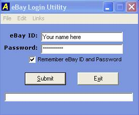



## eBay Login Utility

### Description

eBay Login Utility allows the eBay user to Login into there eBay account with one simple click without having to open the internet browser. It saves your ebay username & password into the registry. It offers Quick Links to eBay, My eBay & PayPal. Feedback is appreciated!
 
### More Info
 

             |
---                |---
**Submitted On**   |2004-09-22 16:57:40
**By**             |[scogadots](https://github.com/Planet-Source-Code/PSCIndex/blob/master/ByAuthor/scogadots.md)
**Level**          |Beginner
**User Rating**    |3.7 (11 globes from 3 users)
**Compatibility**  |VB 3\.0, VB 4\.0 \(16\-bit\), VB 4\.0 \(32\-bit\), VB 5\.0, VB 6\.0
**Category**       |[Internet/ HTML](https://github.com/Planet-Source-Code/PSCIndex/blob/master/ByCategory/internet-html__1-34.md)
**World**          |[Visual Basic](https://github.com/Planet-Source-Code/PSCIndex/blob/master/ByWorld/visual-basic.md)
**Archive File**   |[eBay\_Login1796639222004\.zip](https://github.com/Planet-Source-Code/scogadots-ebay-login-utility__1-56310/archive/master.zip)

